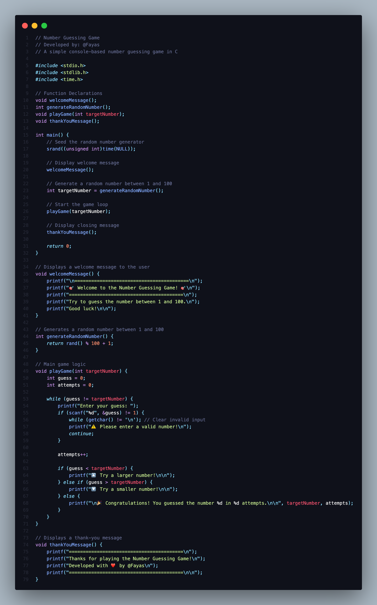
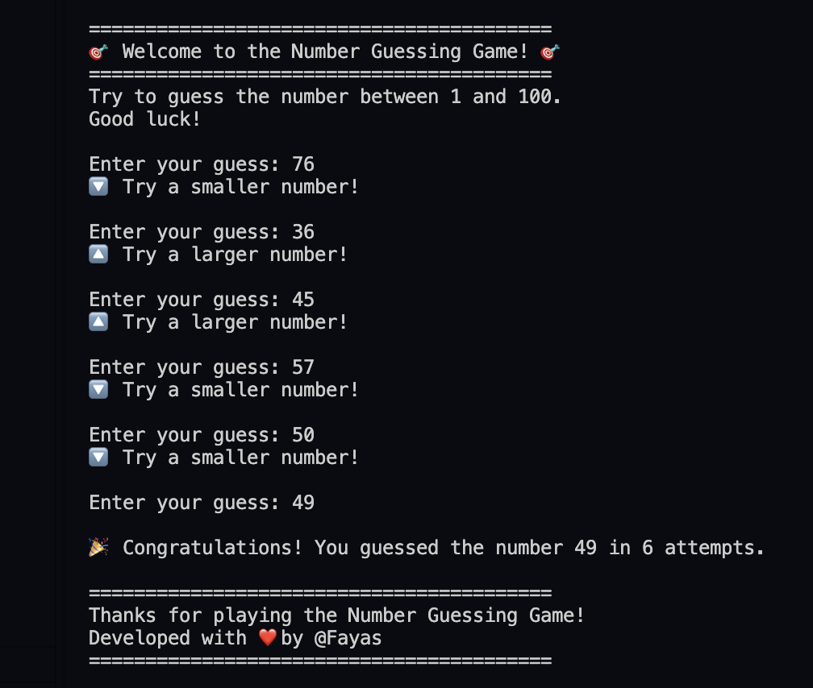

# 🎯 Number Guessing Game in C

Welcome to my C programming project — a terminal-based **Number Guessing Game** that helps users guess a randomly generated number between 1 and 100. It features user-friendly prompts, input validation, and a polished output style.

---

## 📌 Features

- 🎲 Random number generation (1–100)
- 🧠 Smart feedback after each guess (too high / too low)
- 🔁 Looping until the correct guess is made
- ✅ Input validation for non-numeric input
- 🎉 Win message with attempt count
- 🧼 Clean and modular code style

---

## 🛠️ Technologies Used

- Language: **C**
- Compiler: GCC (MinGW/GCC on Linux or Code::Blocks)
- Platform: Console-based CLI

---

## 🧪 Sample Output

> Screenshot of gameplay below:




---

## 🚀 How to Compile and Run

### 🔹 On Windows:

1. Open Command Prompt
2. Navigate to your project folder:
```bash
cd path\to\number-guessing-game-c